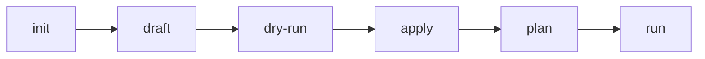

# Quick Start

> **Estimated Time:** 10 minutes | **Difficulty:** Beginner

Get Seeknal installed and running your first data pipeline in under 10 minutes.

!!! info "Choose Your Format"
    Seeknal supports both **YAML** and **Python** workflows. This guide uses YAML (recommended for beginners).

    - **[YAML Quick Start](yaml-variant.md)** — Declarative, version-controlled pipelines
    - **[Python Quick Start](python-variant.md)** — Programmatic control and complex logic

    Both workflows are equally powerful — choose based on your preference.

---

## What You'll Build

A simple data pipeline that:
- Loads sales data from a CSV file
- Calculates daily revenue by product category
- Outputs results to Parquet format

This example works for **all personas** — whether you're a Data Engineer, Analytics Engineer, or ML Engineer, this workflow is the foundation for everything you'll do with Seeknal.

---

## Prerequisites

Before starting, ensure you have:

| Requirement | Version | Check |
|-------------|---------|-------|
| Python | 3.11+ | `python --version` |
| pip | Latest | `pip --version` |

That's it! No databases, no infrastructure, no complex setup.

!!! warning "Python Version Check"
    ```bash
    # Check your Python version
    python --version
    ```

    - If you see **Python 3.11+** — You're ready to go!
    - If you see **Python 3.10 or earlier** — Install a newer version from [python.org](https://www.python.org/downloads/)

    Seeknal requires Python 3.11 or higher.

---

## Part 1: Install & Setup (2 minutes)

### Step 1: Install Seeknal

```bash
pip install seeknal
```

Verify installation:

```bash
seeknal --version
```

**Expected output:** `seeknal x.x.x`

!!! info "More Options"
    For detailed installation instructions (virtual environments, uv, troubleshooting), see the **[Installation Guide](../install/)**.

### Step 2: Initialize Your Project

```bash
# Create a new project
seeknal init --name quickstart-demo
cd quickstart-demo
```

**Expected output:**
```
Creating project 'quickstart-demo'...
  ✓ Created seeknal.yml
  ✓ Created pipelines/ directory
  ✓ Created data/ directory
  ✓ Created output/ directory
Project initialized successfully!
```

**What happened?** Seeknal created a project directory with configuration files. You'll see:
- `seeknal.yml` - Project configuration
- `pipelines/` - Where your pipeline definitions go
- `data/` - For sample and input data
- `output/` - Where results are written

!!! success "Checkpoint"
    You should see a `seeknal.yml` file and `pipelines/` directory. If not, check that `seeknal init` completed successfully.

!!! stuck "Stuck? Installation Issues"
    **Problem:** `seeknal: command not found`

    **Solution:** Make sure your virtual environment is activated:
    ```bash
    # macOS/Linux
    source .venv/bin/activate

    # Windows
    .\.venv\Scripts\activate
    ```

    **Problem:** `Permission denied` error

    **Solution:** Use a virtual environment instead of installing globally (see Step 1).

---

## Part 2: Understand the Pipeline Builder Workflow (2 minutes)

Seeknal uses a **draft → validate → apply → run** workflow for all data pipelines:



| Step | Command | What It Does |
|------|---------|--------------|
| **1. init** | `seeknal init --name <name>` | Creates a new project with configuration |
| **2. draft** | `seeknal draft <kind> <name>` | Generates a template YAML file |
| **3. dry-run** | `seeknal dry-run <file>` | Validates YAML without executing |
| **4. apply** | `seeknal apply <file>` | Saves the node definition to your project |
| **5. plan** | `seeknal plan` | Generates the DAG execution manifest |
| **6. run** | `seeknal run` | Executes your pipeline |

!!! tip "Why This Workflow?"
    - **Safety**: Validate and review changes before executing
    - **Versioning**: Track every modification in git
    - **Collaboration**: Code review for data pipelines
    - **Reproducibility**: Same code, same results

---

## Part 3: Create Your First Pipeline (4 minutes)

### Step 1: Create Sample Data

Create a CSV file with sample sales data:

```bash
cat > data/sales.csv << 'EOF'
date,product_category,quantity,revenue
2024-01-01,Electronics,5,500.00
2024-01-01,Clothing,10,200.00
2024-01-01,Electronics,3,300.00
2024-01-02,Clothing,8,160.00
2024-01-02,Electronics,2,200.00
2024-01-02,Home & Garden,4,120.00
2024-01-03,Electronics,6,600.00
2024-01-03,Clothing,12,240.00
2024-01-03,Home & Garden,3,90.00
EOF
```

### Step 2: Draft and Edit the Source

```bash
seeknal draft source sales_data
```

Edit `seeknal/sources/sales_data.yml`:

```yaml
kind: source
name: sales_data
description: "Sales transaction data"
source: csv
table: "data/sales.csv"
columns:
  date: "Transaction date"
  product_category: "Product category"
  quantity: "Quantity sold"
  revenue: "Revenue in USD"
```

Validate and apply:

```bash
seeknal dry-run seeknal/sources/sales_data.yml
seeknal apply seeknal/sources/sales_data.yml
```

**Expected output:**
```
✓ Applied: seeknal/sources/sales_data.yml
```

!!! info "What's a Source?"
    A source defines where your data comes from — CSV files, Parquet files, databases, or Iceberg tables. Sources are the entry points of your pipeline DAG.

### Step 3: Draft and Edit the Transform

Now let's transform the data — calculate daily revenue by product category:

```bash
seeknal draft transform daily_revenue
```

Edit `seeknal/transforms/daily_revenue.yml`:

```yaml
kind: transform
name: daily_revenue
description: "Daily revenue by product category"

transform: |
  SELECT
    date,
    product_category,
    SUM(quantity) as total_quantity,
    SUM(revenue) as daily_revenue
  FROM ref('source.sales_data')
  GROUP BY date, product_category
  ORDER BY date, daily_revenue DESC

inputs:
  - ref: source.sales_data
```

Validate and apply:

```bash
seeknal dry-run seeknal/transforms/daily_revenue.yml
seeknal apply seeknal/transforms/daily_revenue.yml
```

**Expected output:**
```
✓ Applied: seeknal/transforms/daily_revenue.yml
```

!!! info "Named References with `ref()`"
    The `ref('source.sales_data')` function references your input source by name. This creates an explicit dependency in the DAG, enabling Seeknal to determine execution order and detect changes. The `inputs:` section declares these dependencies.

!!! success "Checkpoint"
    You should have two applied nodes:

    - `sales_data` (source)
    - `daily_revenue` (transform)

    **Verify:** Run `seeknal dry-run` on each file to check for errors.

---

## Part 4: Run and See Results (2 minutes)

### Step 1: Generate Manifest and Execute

```bash
# Generate the DAG manifest
seeknal plan

# Run the full pipeline
seeknal run
```

**Expected output:**
```
Seeknal Pipeline Execution
============================================================
  Project: quickstart-demo

1/2: sales_data [RUNNING]
  SUCCESS in 0.02s
  Rows: 9

2/2: daily_revenue [RUNNING]
  SUCCESS in 0.03s

✓ State saved
```

### Step 2: View Your Results

Use the interactive REPL to inspect the results:

```bash
seeknal repl
```

```sql
-- Check daily revenue
SELECT * FROM daily_revenue;

-- Find the top category
SELECT product_category, SUM(daily_revenue) as total
FROM daily_revenue
GROUP BY product_category
ORDER BY total DESC;
```

**Expected output:**
```
         date product_category  total_quantity  daily_revenue
0  2024-01-01      Electronics               8         800.00
1  2024-01-01        Clothing              10         200.00
2  2024-01-02      Electronics               2         200.00
3  2024-01-02        Clothing               8         160.00
4  2024-01-02   Home & Garden               4         120.00
5  2024-01-03      Electronics               6         600.00
6  2024-01-03        Clothing              12         240.00
7  2024-01-03   Home & Garden               3          90.00
```

!!! success "Congratulations!"
    You just built and ran your first Seeknal pipeline in under 10 minutes!

---

## What's Next?

Choose your path to continue learning:

| Data Engineer | Analytics Engineer | ML Engineer |
|---------------|-------------------|-------------|
| [Build ELT Pipelines](../getting-started/data-engineer-path/1-elt-pipeline.md) | [Define Semantic Models](../getting-started/analytics-engineer-path/1-semantic-models.md) | [Create Feature Groups](../getting-started/ml-engineer-path/1-feature-store.md) |
| Process data at scale | Business metrics & KPIs | ML features with point-in-time joins |

!!! question "Not sure which path?"
    Start with the **Data Engineer** path — it covers the fundamentals that apply to all personas.

---

## Troubleshooting

### Installation Issues

**Problem:** `pip install` fails with permissions error

```bash
# Solution: Use a virtual environment
python -m venv .venv
source .venv/bin/activate  # Windows: .\.venv\Scripts\activate
pip install seeknal
```

**Problem:** `seeknal: command not found`

```bash
# Solution: Make sure your virtual environment is activated
source .venv/bin/activate  # Windows: .\.venv\Scripts\activate
seeknal --version
```

### Pipeline Errors

**Problem:** `seeknal run` shows no nodes to execute

```bash
# Solution: Make sure you ran seeknal plan first
seeknal plan
seeknal run
```

**Problem:** "Column not found" error

```bash
# Solution: Validate your YAML and check column names
seeknal dry-run seeknal/transforms/daily_revenue.yml
```

### Need More Help?

- [Installation Troubleshooting](../install/troubleshooting.md)
- [Full Troubleshooting Guide](../reference/troubleshooting.md)
- [GitHub Issues](https://github.com/mta-tech/seeknal/issues)

---

## Key Concepts

Before moving on, here are the core concepts you just used:

| Concept | Description |
|---------|-------------|
| **Source** | Loads data from files (CSV, Parquet, JSON) or databases (PostgreSQL, Iceberg) |
| **Transform** | Processes data using DuckDB SQL with `ref()` references |
| **Named Refs** | `ref('source.name')` creates explicit dependencies between nodes |
| **DAG** | Directed Acyclic Graph — Seeknal automatically determines execution order |
| **REPL** | Interactive SQL environment for exploring pipeline results |

**Key Commands:**
```bash
seeknal init --name <name>         # Create project
seeknal draft source <name>        # Generate source template
seeknal draft transform <name>     # Generate transform template
seeknal dry-run <file>             # Validate YAML
seeknal apply <file>               # Save node definition
seeknal plan                       # Generate DAG manifest
seeknal run                        # Execute pipeline
seeknal repl                       # Interactive SQL queries
```

## Summary

In this Quick Start, you learned:

- [x] How to install Seeknal
- [x] The pipeline builder workflow (init → draft → dry-run → apply → plan → run)
- [x] How to create sources and transforms with named references
- [x] How to run a pipeline and inspect results with the REPL

**Time taken:** ~10 minutes | **Next:** Choose your learning path
