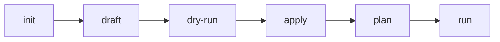

# Quick Start - YAML Pipeline

> **Estimated Time:** 10 minutes | **Difficulty:** Beginner | **Format:** YAML

Build your first Seeknal pipeline using YAML. This approach is ideal for:
- **Data Engineers** who want version-controlled, declarative pipelines
- **Analytics Engineers** who prefer SQL-based transformations
- **ML Engineers** who need reproducible, reviewable feature definitions

---

## Why YAML?

YAML pipelines offer several advantages:

- **Version Control**: Every change is tracked in git
- **Code Review**: Pipeline changes can be reviewed like code
- **Declarative**: Describe what you want, not how to get there
- **Reproducible**: Same pipeline, same results, every time

---

## Prerequisites

Before starting, ensure you have:

| Requirement | Version | Check |
|-------------|---------|-------|
| Python | 3.11+ | `python --version` |
| pip | Latest | `pip --version` |

!!! warning "Python Version Check"
    ```bash
    # Check your Python version
    python --version
    ```

    Seeknal requires Python 3.11 or higher.

---

## Part 1: Install & Setup (2 minutes)

### Step 1: Install Seeknal

```bash
pip install seeknal

# Verify installation
seeknal --version
```

**Expected output:** `seeknal x.x.x`

!!! info "More Options"
    For detailed installation instructions, see the **[Installation Guide](../install/)**.

### Step 2: Initialize Your Project

```bash
# Create a new project
seeknal init --name quickstart-yaml
cd quickstart-yaml
```

**Expected output:**
```
Creating project 'quickstart-yaml'...
  ✓ Created seeknal.yml
  ✓ Created pipelines/ directory
  ✓ Created data/ directory
  ✓ Created output/ directory
Project initialized successfully!
```

---

## Part 2: Understand the YAML Pipeline Workflow (2 minutes)

Seeknal's YAML workflow follows a **draft → validate → apply → run** process:



| Step | Command | What It Does |
|------|---------|--------------|
| **1. init** | `seeknal init --name <name>` | Creates project structure |
| **2. draft** | `seeknal draft <kind> <name>` | Generates YAML template |
| **3. dry-run** | `seeknal dry-run <file>` | Validates YAML without executing |
| **4. apply** | `seeknal apply <file>` | Saves node definition |
| **5. plan** | `seeknal plan` | Generates DAG manifest |
| **6. run** | `seeknal run` | Executes pipeline |

!!! tip "Why This Workflow?"
    YAML files become part of your codebase — track them in git, review them in PRs, and deploy them with confidence.

---

## Part 3: Create Your YAML Pipeline (4 minutes)

### Step 1: Create Sample Data

Create `data/sales.csv`:

```csv
date,product_category,quantity,revenue
2024-01-01,Electronics,5,500.00
2024-01-01,Clothing,10,200.00
2024-01-01,Electronics,3,300.00
2024-01-02,Clothing,8,160.00
2024-01-02,Electronics,2,200.00
2024-01-02,Home & Garden,4,120.00
2024-01-03,Electronics,6,600.00
2024-01-03,Clothing,12,240.00
2024-01-03,Home & Garden,3,90.00
```

### Step 2: Draft and Edit the Source

```bash
seeknal draft source sales_data
```

Edit `seeknal/sources/sales_data.yml`:

```yaml
kind: source
name: sales_data
description: "Sales transaction data"
source: csv
table: "data/sales.csv"
columns:
  date: "Transaction date"
  product_category: "Product category"
  quantity: "Quantity sold"
  revenue: "Revenue in USD"
```

Validate and apply:

```bash
seeknal dry-run seeknal/sources/sales_data.yml
seeknal apply seeknal/sources/sales_data.yml
```

### Step 3: Draft and Edit the Transform

```bash
seeknal draft transform daily_revenue
```

Edit `seeknal/transforms/daily_revenue.yml`:

```yaml
kind: transform
name: daily_revenue
description: "Daily revenue by product category"

transform: |
  SELECT
    date,
    product_category,
    SUM(quantity) as total_quantity,
    SUM(revenue) as daily_revenue
  FROM ref('source.sales_data')
  GROUP BY date, product_category
  ORDER BY date, daily_revenue DESC

inputs:
  - ref: source.sales_data
```

Validate and apply:

```bash
seeknal dry-run seeknal/transforms/daily_revenue.yml
seeknal apply seeknal/transforms/daily_revenue.yml
```

!!! info "Named References with `ref()`"
    The `ref('source.sales_data')` function references your input source by name. This creates an explicit dependency in the DAG, enabling Seeknal to determine execution order automatically. The `inputs:` section declares these dependencies.

!!! success "Checkpoint"
    You now have two YAML files defining your pipeline:

    - `seeknal/sources/sales_data.yml`
    - `seeknal/transforms/daily_revenue.yml`

    These files can be version-controlled, code-reviewed, and deployed like any other code.

---

## Part 4: Run and Verify (2 minutes)

### Step 1: Generate Manifest and Execute

```bash
# Generate the DAG manifest
seeknal plan

# Run the full pipeline
seeknal run
```

**Expected output:**
```
Seeknal Pipeline Execution
============================================================
1/2: sales_data [RUNNING]
  SUCCESS in 0.02s

2/2: daily_revenue [RUNNING]
  SUCCESS in 0.03s

✓ State saved
```

### Step 2: View Your Results

Use the interactive REPL to query results:

```bash
seeknal repl
```

```sql
SELECT * FROM daily_revenue;
```

**Expected output:**
```
         date product_category  total_quantity  daily_revenue
0  2024-01-01      Electronics               8         800.00
1  2024-01-01        Clothing              10         200.00
2  2024-01-02      Electronics               2         200.00
3  2024-01-02        Clothing               8         160.00
4  2024-01-02   Home & Garden               4         120.00
5  2024-01-03      Electronics               6         600.00
6  2024-01-03        Clothing              12         240.00
7  2024-01-03   Home & Garden               3          90.00
```

!!! success "Congratulations! :tada:"
    You've built a complete data pipeline using YAML — version-controlled, reviewable, and reproducible.

---

## What Makes YAML Great?

### For Data Engineers
```yaml
# Infrastructure-as-code mindset
kind: transform
name: customer_orders
sql: |
  SELECT * FROM staging.orders
  WHERE processed_at IS NULL
```

### For Analytics Engineers
```yaml
# Business metrics as code
kind: transform
name: revenue_kpi
sql: |
  SELECT
    DATE(order_date) as date,
    SUM(revenue) as total_revenue
  FROM orders
  GROUP BY 1
```

### For ML Engineers
```yaml
# Feature definitions as code
kind: transform
name: user_features
sql: |
  SELECT
    user_id,
    AVG(session_duration) as avg_session,
    COUNT(DISTINCT product_id) as product_diversity
  FROM user_events
  GROUP BY user_id
```

---

## What's Next?

Choose your learning path:

| Data Engineer | Analytics Engineer | ML Engineer |
|---------------|-------------------|-------------|
| [Build ELT Pipelines](../getting-started/data-engineer-path/1-elt-pipeline.md) | [Define Semantic Models](../getting-started/analytics-engineer-path/1-semantic-models.md) | [Create Feature Groups](../getting-started/ml-engineer-path/1-feature-store.md) |

---

## Troubleshooting

!!! stuck "Common Issues"
    **Problem:** `YAML validation failed`
    - Check indentation (use spaces, not tabs)
    - Verify no trailing commas

    **Problem:** `Source not found`
    - Run `seeknal status` to verify applied resources
    - Re-apply any missing sources

    **Problem:** `SQL syntax error`
    - Check column names match source schema
    - Verify SQL syntax in your transform

[Full Troubleshooting Guide →](../troubleshooting/)
