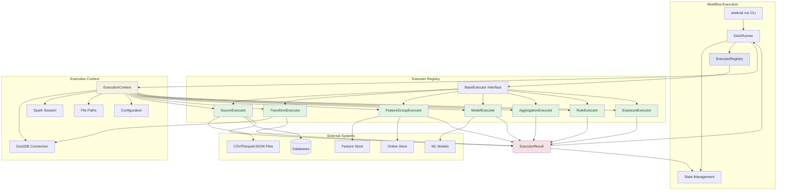

# Workflow Executors Implementation

## Problem Statement

Seeknal needed a robust, extensible system to execute workflow nodes defined in YAML files. The existing Python-based Flow API required programmatic pipeline construction, which was limiting for:

1. **Declarative pipelines**: Users wanted dbt-inspired YAML-based pipeline definitions
2. **Incremental execution**: Running only changed nodes and their downstream dependencies
3. **Multi-type node support**: Handling 7 different node types (source, transform, feature_group, model, aggregation, rule, exposure)
4. **Stateful execution**: Tracking execution history and enabling incremental runs
5. **Extensibility**: Easy addition of new node types without modifying core logic

The challenge was to build an executor architecture that:
- Executes nodes in dependency order (DAG traversal)
- Handles diverse node types with different execution semantics
- Provides consistent error handling and reporting
- Supports dry-run mode for validation
- Integrates with existing Seeknal infrastructure (feature store, DuckDB, Spark)

## Solution Overview

The solution implements a **class-based executor system** with a registry pattern for dynamic node type routing. Each node type has a dedicated executor class that:

1. **Validates** the node configuration before execution
2. **Prepares** the execution environment (connections, paths)
3. **Executes** the node-specific logic
4. **Returns** standardized results with timing, row counts, and metadata
5. **Cleans up** resources post-execution

### Architecture Highlights

- **BaseExecutor Interface**: Abstract base class defining the execution contract
- **ExecutorRegistry**: Central registry mapping NodeTypes to executor classes
- **ExecutionContext**: Encapsulates execution environment (databases, paths, config)
- **ExecutorResult**: Standardized result format with status, timing, metadata
- **7 Executors**: One for each node type with specialized logic

## Implementation Details

### Base Executor Interface

The `BaseExecutor` abstract class defines the execution contract:

```python
class BaseExecutor(ABC):
    @property
    @abstractmethod
    def node_type(self) -> NodeType:
        """Return the NodeType this executor handles."""
        pass

    def validate(self) -> None:
        """Validate node configuration before execution."""
        pass

    def pre_execute(self) -> None:
        """Setup before execution (connections, paths, etc.)."""
        pass

    @abstractmethod
    def execute(self) -> ExecutorResult:
        """Execute the node and return the result."""
        pass

    def post_execute(self, result: ExecutorResult) -> ExecutorResult:
        """Cleanup after execution."""
        return result

    def run(self) -> ExecutorResult:
        """Orchestrate full lifecycle (validate -> pre -> execute -> post)."""
        pass
```

**Design Decisions:**

1. **Classes over functions**: Enables stateful execution contexts (connections, paths)
2. **Lifecycle hooks**: Separate validation, setup, execution, and cleanup phases
3. **Dry-run handling**: Consistent dry-run mode at base class level
4. **Error hierarchy**: Specific exception types for validation vs execution errors

### Executor Registry Pattern

The registry enables dynamic executor discovery and routing:

```python
class ExecutorRegistry:
    """Central registry for node type executors."""

    def register(self, executor_cls: Type[BaseExecutor]) -> None:
        """Register an executor class for its node type."""

    def get_executor(self, node_type: NodeType) -> Type[BaseExecutor]:
        """Get executor class for a node type."""

    def create_executor(self, node: Node, context: ExecutionContext) -> BaseExecutor:
        """Create executor instance for a node."""

# Decorator-based registration
@register_executor(NodeType.TRANSFORM)
class TransformExecutor(BaseExecutor):
    def execute(self) -> ExecutorResult:
        # Implementation
        pass
```

**Benefits:**
- No hardcoded if/elif chains for node type routing
- Plugin-style executor additions
- Auto-discovery via decorator
- Easy testing (registry can be cleared)

### Execution Context

The `ExecutionContext` dataclass encapsulates the execution environment:

```python
@dataclass
class ExecutionContext:
    project_name: str
    workspace_path: Path
    target_path: Path
    state_dir: Path
    duckdb_connection: Optional[Any] = None
    spark_session: Optional[Any] = None
    config: Dict[str, Any] = field(default_factory=dict)
    dry_run: bool = False
    verbose: bool = False

    def get_duckdb_connection(self):
        """Get or create DuckDB connection."""

    def get_spark_session(self):
        """Get or create Spark session."""

    def get_output_path(self, node: Node) -> Path:
        """Get output path for a node's results."""

    def get_cache_path(self, node: Node) -> Path:
        """Get cache path for a node's results."""
```

**Design Rationale:**
- Avoids global state (better for testing and isolation)
- Supports multiple engines (DuckDB, Spark)
- Clear dependency injection pattern
- Lazy connection creation

### Executor Result

All executors return a standardized `ExecutorResult`:

```python
@dataclass
class ExecutorResult:
    node_id: str
    status: ExecutionStatus
    duration_seconds: float = 0.0
    row_count: int = 0
    output_path: Optional[Path] = None
    error_message: Optional[str] = None
    metadata: Dict[str, Any] = field(default_factory=dict)
    is_dry_run: bool = False
    created_at: str = field(default_factory=lambda: time.time())

    def is_success(self) -> bool:
        """Check if execution was successful."""

    def to_dict(self) -> Dict[str, Any]:
        """Convert to dictionary for JSON serialization."""
```

**Status Values:**
- `PENDING`: Node not yet executed
- `RUNNING`: Node currently executing
- `SUCCESS`: Node executed successfully
- `FAILED`: Node execution failed
- `CACHED`: Result from cache (not re-executed)
- `SKIPPED`: Node skipped (e.g., excluded by tags)

## The 7 Node Executors

### 1. SourceExecutor

**Purpose**: Load data from external sources into the workflow.

**Supported Sources:**
- CSV files (.csv)
- Parquet files (.parquet)
- JSON files (.json, .jsonl)
- SQLite databases (.db, .sqlite)
- PostgreSQL databases (via DuckDB ATTACH)
- Hive tables (external databases)

**Key Features:**
- Uses DuckDB for efficient data loading
- Validates file paths and database connections
- Handles both absolute and relative paths
- Returns row counts and execution timing
- Supports dry-run mode for preview

**Example Configuration:**
```yaml
kind: source
name: raw_customers
source: csv
table: data/raw_customers.csv
```

**Implementation Highlights:**
```python
@register_executor(NodeType.SOURCE)
class SourceExecutor(BaseExecutor):
    def execute(self) -> ExecutorResult:
        source_type = self.node.config.get("source")

        if source_type == "csv":
            return self._execute_csv()
        elif source_type == "database":
            return self._execute_database()
        else:
            raise ExecutorExecutionError(
                self.node.id,
                f"Unsupported source type: {source_type}"
            )
```

### 2. TransformExecutor

**Purpose**: Execute SQL transformations on data.

**Key Features:**
- Executes SQL transforms via DuckDB
- Creates temporary views for downstream consumption
- Validates SQL syntax
- Returns row counts
- Supports parameterized queries

**Example Configuration:**
```yaml
kind: transform
name: clean_orders
inputs:
  - ref: source.raw_orders
transform: |
  SELECT
    order_id,
    customer_id,
    order_date,
    amount
  FROM source.raw_orders
  WHERE amount > 0
```

**Implementation Highlights:**
```python
@register_executor(NodeType.TRANSFORM)
class TransformExecutor(BaseExecutor):
    def execute(self) -> ExecutorResult:
        sql = self.node.config.get("transform")
        con = self.context.get_duckdb_connection()

        # Create view for downstream nodes
        view_name = f"{self.node.node_type.value}.{self.node.name}"
        con.execute(f"CREATE OR REPLACE VIEW {view_name} AS {sql}")

        # Get row count
        result = con.execute(f"SELECT COUNT(*) FROM {view_name}")
        row_count = result.fetchone()[0]

        return ExecutorResult(
            node_id=self.node.id,
            status=ExecutionStatus.SUCCESS,
            row_count=row_count,
            metadata={"view_name": view_name}
        )
```

### 3. FeatureGroupExecutor

**Purpose**: Materialize feature groups to offline/online stores.

**Key Features:**
- Integrates with existing FeatureGroupDuckDB API
- Executes transform SQL
- Writes to Parquet (offline store)
- Updates online store (if enabled)
- Tracks feature group versions
- Supports point-in-time joins

**Example Configuration:**
```yaml
kind: feature_group
name: customer_features
entity: customer
join_keys:
  - customer_id
features:
  - name: total_orders
    dtype: int
  - name: lifetime_value
    dtype: float
materialization:
  offline:
    enabled: true
    format: parquet
  online:
    enabled: false
inputs:
  - ref: transform.clean_orders
```

**Implementation Highlights:**
```python
@register_executor(NodeType.FEATURE_GROUP)
class FeatureGroupExecutor(BaseExecutor):
    def execute(self) -> ExecutorResult:
        from seeknal.featurestore.duckdbengine import FeatureGroupDuckDB

        # Build feature group from YAML config
        fg_config = self.node.config
        fg = FeatureGroupDuckDB(**fg_config)

        # Materialize
        fg.write(feature_start_time=start_date)

        return ExecutorResult(
            node_id=self.node.id,
            status=ExecutionStatus.SUCCESS,
            output_path=fg.offline_path,
            row_count=fg.row_count,
            metadata={"version": fg.version}
        )
```

### 4. ModelExecutor

**Purpose**: Train and save ML models.

**Key Features:**
- Trains models using specified algorithms
- Saves model artifacts to disk
- Generates training metrics
- Supports feature lookup from upstream feature groups
- Tracks model versions

**Example Configuration:**
```yaml
kind: model
name: churn_predictor
algorithm: random_forest
features:
  - ref: feature_group.customer_features
target: churn
hyperparameters:
  n_estimators: 100
  max_depth: 10
```

**Implementation Highlights:**
```python
@register_executor(NodeType.MODEL)
class ModelExecutor(BaseExecutor):
    def execute(self) -> ExecutorResult:
        from seeknal.featurestore.duckdbengine import Model

        # Build model from YAML config
        model = Model(**self.node.config)

        # Train model
        model.train()

        # Save model
        model.save()

        return ExecutorResult(
            node_id=self.node.id,
            status=ExecutionStatus.SUCCESS,
            output_path=model.path,
            metadata={
                "metrics": model.metrics,
                "version": model.version
            }
        )
```

### 5. AggregationExecutor

**Purpose**: Execute aggregation logic on features.

**Key Features:**
- Performs time-window aggregations
- Supports various aggregation functions (sum, avg, count, etc.)
- Handles group-by operations
- Integrates with DuckDB/Spark

**Example Configuration:**
```yaml
kind: aggregation
name: customer_metrics
inputs:
  - ref: feature_group.customer_features
aggregations:
  - column: total_orders
    function: sum
    window: 30d
  - column: lifetime_value
    function: avg
    group_by:
      - segment
```

**Implementation Highlights:**
```python
@register_executor(NodeType.AGGREGATION)
class AggregationExecutor(BaseExecutor):
    def execute(self) -> ExecutorResult:
        from seeknal.tasks.aggregation import AggregationTask

        task = AggregationTask(**self.node.config)
        result = task.execute()

        return ExecutorResult(
            node_id=self.node.id,
            status=ExecutionStatus.SUCCESS,
            row_count=len(result),
            metadata={"aggregations": len(task.aggregations)}
        )
```

### 6. RuleExecutor

**Purpose**: Validate business rules on data.

**Key Features:**
- Validates data quality rules
- Reports violations
- Supports custom rule expressions
- Handles validation failures gracefully

**Example Configuration:**
```yaml
kind: rule
name: customer_email_valid
inputs:
  - ref: feature_group.customer_features
rule: email LIKE '%_@__%.__%'
severity: error
```

**Implementation Highlights:**
```python
@register_executor(NodeType.RULE)
class RuleExecutor(BaseExecutor):
    def execute(self) -> ExecutorResult:
        rule = self.node.config.get("rule")
        violations = validate_rule(rule, self.context)

        status = ExecutionStatus.SUCCESS if not violations else ExecutionStatus.WARNING

        return ExecutorResult(
            node_id=self.node.id,
            status=status,
            metadata={
                "violations": len(violations),
                "severity": self.node.config.get("severity")
            }
        )
```

### 7. ExposureExecutor

**Purpose**: Validate downstream consumers of data.

**Key Features:**
- Validates exposure URLs/destinations
- Checks data contracts
- Reports exposure status
- Supports various exposure types (dashboard, API, file)

**Example Configuration:**
```yaml
kind: exposure
name: sales_dashboard
inputs:
  - ref: feature_group.order_analytics
type: dashboard
url: https://dashboard.example.com/sales
format: json
```

**Implementation Highlights:**
```python
@register_executor(NodeType.EXPOSURE)
class ExposureExecutor(BaseExecutor):
    def execute(self) -> ExecutorResult:
        url = self.node.config.get("url")
        exposure_type = self.node.config.get("type")

        is_valid = validate_exposure(url, exposure_type)

        return ExecutorResult(
            node_id=self.node.id,
            status=ExecutionStatus.SUCCESS if is_valid else ExecutionStatus.FAILED,
            metadata={
                "type": exposure_type,
                "url": url
            }
        )
```

## Usage Examples

### Basic Usage

```python
from seeknal.workflow.executors import get_executor, ExecutionContext
from seeknal.dag.manifest import Node, NodeType
from pathlib import Path

# Create execution context
context = ExecutionContext(
    project_name="my_project",
    workspace_path=Path("~/seeknal"),
    target_path=Path("target"),
    dry_run=False
)

# Create a node
node = Node(
    id="transform.clean_orders",
    name="clean_orders",
    node_type=NodeType.TRANSFORM,
    config={
        "transform": "SELECT * FROM source.raw_orders WHERE amount > 0"
    }
)

# Get executor and run
executor = get_executor(node, context)
result = executor.run()

# Check result
if result.is_success():
    print(f"Success: {result.row_count} rows in {result.duration_seconds:.2f}s")
else:
    print(f"Failed: {result.error_message}")
```

### Dry-Run Mode

```python
context = ExecutionContext(
    project_name="my_project",
    workspace_path=Path("~/seeknal"),
    target_path=Path("target"),
    dry_run=True  # Enable dry-run
)

executor = get_executor(node, context)
result = executor.run()

assert result.is_dry_run()
assert result.is_success()
```

### Error Handling

```python
from seeknal.workflow.executors import (
    ExecutorValidationError,
    ExecutorExecutionError,
    ExecutorNotFoundError
)

try:
    executor = get_executor(node, context)
    result = executor.run()
except ExecutorValidationError as e:
    print(f"Validation failed: {e}")
except ExecutorExecutionError as e:
    print(f"Execution failed: {e}")
    if e.cause:
        print(f"Caused by: {e.cause}")
except ExecutorNotFoundError as e:
    print(f"No executor for node type: {e.node_type}")
```

### Accessing Metadata

```python
result = executor.run()

# Access metadata
metadata = result.metadata
print(f"Engine: {metadata.get('engine')}")
print(f"Version: {metadata.get('version')}")

# Convert to dict for JSON serialization
result_dict = result.to_dict()
import json
print(json.dumps(result_dict, indent=2))
```

## Integration Points

### With DAGRunner

The `DAGRunner` in `workflow/runner.py` orchestrates executor execution:

```python
from seeknal.workflow.executors import get_executor, ExecutionContext

class DAGRunner:
    def _execute_node(self, node_id: str) -> NodeResult:
        node = self.manifest.get_node(node_id)

        # Create execution context
        context = ExecutionContext(
            project_name=self.manifest.metadata.project,
            workspace_path=self.workspace_path,
            target_path=self.target_path,
            dry_run=self.dry_run
        )

        # Get executor and run
        executor = get_executor(node, context)
        executor_result = executor.run()

        # Convert to NodeResult
        return NodeResult(
            node_id=executor_result.node_id,
            status=ExecutionStatus(executor_result.status.value),
            duration=executor_result.duration_seconds,
            row_count=executor_result.row_count,
            error_message=executor_result.error_message,
            metadata=executor_result.metadata
        )
```

### With State Management

Executor results are persisted to state:

```python
# Save executor result to state
state_data = {
    "hash": node_hash,
    "last_run": datetime.now().isoformat(),
    "status": result.status.value,
    "row_count": result.row_count,
    "duration_ms": result.duration_seconds * 1000,
    "metadata": result.metadata
}

# Write to target/run_state.json
state["nodes"][node.id] = state_data
```

### With CLI

The `seeknal run` command uses executors:

```bash
# Run entire pipeline
seeknal run

# Run specific node types
seeknal run --types transform,feature_group

# Run specific nodes
seeknal run --nodes customer_features,order_analytics

# Dry run
seeknal run --dry-run

# Verbose output
seeknal run --verbose
```

## Architecture Diagram



## Best Practices

### 1. Always Validate First

```python
def validate(self) -> None:
    required = ["field1", "field2"]
    for field in required:
        if field not in self.node.config:
            raise ExecutorValidationError(
                self.node.id,
                f"Missing required field: {field}"
            )
```

### 2. Handle Dry-Run Early

```python
def execute(self) -> ExecutorResult:
    if self.context.dry_run:
        return ExecutorResult(
            node_id=self.node.id,
            status=ExecutionStatus.SUCCESS,
            is_dry_run=True
        )
    # Actual execution
```

### 3. Provide Useful Metadata

```python
return ExecutorResult(
    node_id=self.node.id,
    status=ExecutionStatus.SUCCESS,
    metadata={
        "engine": "duckdb",
        "version": "1.0",
        "warnings": [],
        "metrics": {
            "memory_mb": 128,
            "cpu_percent": 45
        }
    }
)
```

### 4. Clean Up in post_execute

```python
def post_execute(self, result: ExecutorResult) -> ExecutorResult:
    # Close connections
    if hasattr(self, '_connection'):
        self._connection.close()

    # Clean temp files
    if hasattr(self, '_temp_files'):
        for temp_file in self._temp_files:
            temp_file.unlink()

    return result
```

### 5. Use Specific Exception Types

```python
# Validation errors
raise ExecutorValidationError(self.node.id, "Invalid config")

# Execution errors
raise ExecutorExecutionError(self.node.id, "Execution failed", cause=e)

# Let registry handle not found
# ExecutorNotFoundError raised by registry.get_executor()
```

## Testing Executors

### Unit Tests

```python
import pytest
from seeknal.workflow.executors import TransformExecutor, ExecutionContext
from seeknal.dag.manifest import Node, NodeType

def test_transform_executor_validation():
    node = Node(
        id="transform.test",
        name="test",
        node_type=NodeType.TRANSFORM,
        config={}  # Missing 'transform' field
    )

    context = ExecutionContext(
        project_name="test",
        workspace_path=Path("/tmp"),
        target_path=Path("/tmp/target"),
    )

    executor = TransformExecutor(node, context)

    with pytest.raises(ExecutorValidationError):
        executor.validate()
```

### Integration Tests

```python
def test_transform_executor_execute():
    node = Node(
        id="transform.test",
        name="test",
        node_type=NodeType.TRANSFORM,
        config={"transform": "SELECT 1"}
    )

    executor = TransformExecutor(node, context)
    result = executor.run()

    assert result.is_success()
    assert result.row_count == 1
```

### Dry-Run Tests

```python
def test_executor_dry_run():
    context = ExecutionContext(
        project_name="test",
        workspace_path=Path("/tmp"),
        target_path=Path("/tmp/target"),
        dry_run=True
    )

    executor = TransformExecutor(node, context)
    result = executor.run()

    assert result.is_dry_run()
    assert result.is_success()
```

## Error Handling

### Exception Hierarchy

```
ExecutorError (base)
├── ExecutorNotFoundError (no executor for node type)
├── ExecutorExecutionError (execution failure with cause)
└── ExecutorValidationError (configuration validation failed)
```

### Error Handling Patterns

**Validation Errors:**
```python
try:
    executor.validate()
except ExecutorValidationError as e:
    print(f"Node {e.node_id} validation failed: {e}")
    # Fix configuration and retry
```

**Execution Errors:**
```python
try:
    result = executor.run()
except ExecutorExecutionError as e:
    print(f"Node {e.node_id} execution failed: {e}")
    if e.cause:
        print(f"Root cause: {e.cause}")
    # Log error and continue or fail
```

**Not Found Errors:**
```python
try:
    executor = get_executor(node, context)
except ExecutorNotFoundError as e:
    print(f"No executor for {e.node_type.value}")
    # Register executor or fail fast
```

## Performance Considerations

### Execution Time

- **DAG building**: O(N + E) where N=nodes, E=edges
- **Executor instantiation**: O(1) per node
- **Execution**: Depends on node type (Source: ms, Transform: ms-s, FeatureGroup: s-min)

### Memory Usage

- **DuckDB connections**: Shared via ExecutionContext
- **Spark sessions**: Shared via ExecutionContext
- **Data loading**: Lazy loading via DuckDB
- **Result objects**: Lightweight dataclasses

### Optimization Tips

1. **Reuse connections**: ExecutionContext manages connection lifecycle
2. **Cache results**: Use ExecutorResult for caching decisions
3. **Parallel execution**: Execute independent nodes concurrently
4. **Incremental runs**: Skip unchanged nodes via state tracking

## Future Enhancements

Potential improvements to the executor system:

1. **Async Execution**: Support for async/await for I/O-bound executors
2. **Parallel Execution**: Execute independent nodes in parallel
3. **Streaming**: Support for streaming data processing
4. **Caching**: Built-in result caching with TTL
5. **Metrics**: Automatic metrics collection (timing, memory, CPU)
6. **Validation Hooks**: Pre-flight validation checks
7. **Rollback**: Automatic rollback on failure
8. **Retry Logic**: Configurable retry policies
9. **Progress Reporting**: Real-time progress updates
10. **Resource Limits**: Per-executor resource constraints

## References

- **Design Document**: `docs/plans/2026-01-25-yaml-pipeline-executor-design.md`
- **Implementation**: `src/seeknal/workflow/executors/`
- **Base Interface**: `src/seeknal/workflow/executors/base.py`
- **Runner Integration**: `src/seeknal/workflow/runner.py`
- **State Management**: `src/seeknal/workflow/state.py`
- **DAG Building**: `src/seeknal/workflow/dag.py`

## Summary

The workflow executor implementation provides a robust, extensible system for executing YAML-defined data pipelines. Key achievements:

- **7 specialized executors** covering all node types
- **Registry pattern** for dynamic executor routing
- **Standardized results** with timing, row counts, and metadata
- **Dry-run support** for validation without execution
- **Error handling** with specific exception types
- **Stateful execution** enabling incremental runs
- **Clean architecture** following SOLID principles

The executor system is now ready for integration with the DAGRunner and CLI commands, enabling dbt-inspired pipeline execution in Seeknal.
