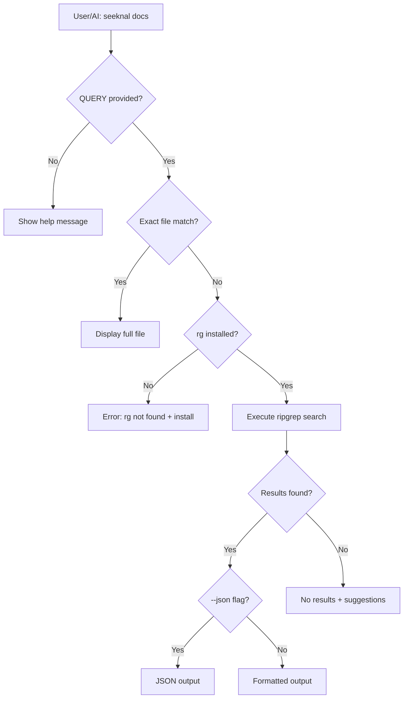

# feat: Add CLI-Accessible Documentation for AI Agents

## Overview

Add a `seeknal docs` command that provides CLI-accessible documentation optimized for AI agents. This enables both AI agents and developers to query documentation via CLI without browsing the filesystem, with structured JSON output for machine consumption.

**Command examples:**
```bash
seeknal docs init              # Show docs/cli/init.md (exact file match)
seeknal docs "feature group"   # Search for "feature group" in all CLI docs
seeknal docs --list            # List all available topics
seeknal docs --json "version"  # JSON output for AI consumption
```

## Problem Statement / Motivation

**Current State:**
- Seeknal has extensive documentation in `docs/` (150+ markdown files)
- No CLI-accessible way to query documentation
- AI agents cannot easily discover or access relevant docs
- Users must manually browse filesystem or switch to web docs

**Problems:**
1. **AI agents** struggle to find relevant documentation without file system access
2. **Developers** cannot quickly access docs from terminal during development
3. **Discovery** of available documentation topics is poor
4. **Context switching** between terminal and docs is inefficient

**Solution:** Add `seeknal docs` command with ripgrep-powered local search and AI-optimized JSON output.

## Proposed Solution

### Architecture



### Command Interface

```python
# src/seeknal/cli/docs.py

@app.command("docs")
def docs_command(
    query: List[str] = typer.Argument(None, help="Search query or topic name"),
    list_topics: bool = typer.Option(False, "--list", "-l", help="List all available topics"),
    json_output: bool = typer.Option(False, "--json", "-j", help="Output as JSON"),
    max_results: int = typer.Option(50, "--max-results", "-n", help="Maximum results to return"),
):
    """Search Seeknal CLI documentation or show specific topics.

    \b
    Examples:
        seeknal docs init              # Show init command docs
        seeknal docs "feature group"   # Search for "feature group"
        seeknal docs --list            # List all available topics
        seeknal docs --json "version"  # JSON output for AI consumption
    """
```

### Ripgrep Integration

```python
# src/seeknal/cli/docs.py

RG_FLAGS = [
    "--with-filename",    # Show file names
    "--line-number",      # Show line numbers
    "--ignore-case",      # Case-insensitive search
    "--fixed-strings",    # Treat as literal, not regex
    "--glob", "*.md",     # Only search .md files
    "--json",             # JSON output for parsing
]

def check_rg_installed() -> bool:
    """Check if ripgrep is available."""
    return shutil.which("rg") is not None

def run_rg_search(query: str, docs_path: Path) -> List[SearchResult]:
    """Execute ripgrep search and parse results."""
    cmd = ["rg"] + RG_FLAGS + ["--", query, str(docs_path)]
    result = subprocess.run(cmd, capture_output=True, text=True, timeout=30)
    return parse_rg_json_output(result.stdout)
```

### Output Format

**Human-readable (default):**
```
Found 3 results for "feature group":

docs/cli/feature-group.md:10
  ...FeatureGroup is a container for related features with...

docs/cli/list.md:45
  ...Use --type feature-group to list only feature groups...

docs/cli/init.md:23
  ...Creates a feature_group.yaml template file...
```

**JSON output (`--json`):**
```json
{
  "query": "feature group",
  "results": [
    {
      "file_path": "docs/cli/feature-group.md",
      "line_number": 10,
      "snippet": "...FeatureGroup is a container for related features with...",
      "metadata": {
        "summary": "Manage feature groups",
        "read_when": "You need to organize features by entity"
      }
    }
  ],
  "total_count": 3,
  "truncated": false
}
```

**List output (`--list`):**
```
Available CLI documentation (24 topics):

  atlas             Manage Apache Iceberg tables and namespaces
  clean             Remove old feature data from storage
  delete            Delete resources (feature groups, sources, etc.)
  env               Manage virtual environments for pipelines
  init              Initialize a new Seeknal project
  list              List resources in the current project
  ...
```

### Exit Codes

| Code | Meaning | When Used |
|------|---------|-----------|
| 0 | Success | Results found or help displayed |
| 1 | No results | Query executed but found nothing |
| 2 | Invalid arguments | Bad flags or arguments |
| 3 | Ripgrep not found | `rg` binary not installed |
| 4 | Internal error | Unexpected error occurred |

### Documentation Structure

```
docs/cli/
├── index.md              # CLI overview (comprehensive reference)
├── apply.md              # seeknal apply
├── atlas.md              # seeknal atlas
├── audit.md              # seeknal audit
├── clean.md              # seeknal clean
├── connection-test.md    # seeknal connection-test
├── delete.md             # seeknal delete
├── delete-table.md       # seeknal delete-table
├── diff.md               # seeknal diff
├── download-sample-data.md
├── draft.md              # seeknal draft
├── dry-run.md            # seeknal dry-run
├── env.md                # seeknal env (subcommand group)
├── info.md               # seeknal info
├── init.md               # seeknal init
├── inspect.md            # seeknal inspect
├── intervals.md          # seeknal intervals
├── list.md               # seeknal list
├── parse.md              # seeknal parse
├── plan.md               # seeknal plan
├── promote.md            # seeknal promote
├── query.md              # seeknal query
├── repl.md               # seeknal repl
├── run.md                # seeknal run
├── show.md               # seeknal show
├── validate.md           # seeknal validate
├── validate-features.md  # seeknal validate-features
└── version.md            # seeknal version (subcommand group)
```

**Frontmatter template:**
```markdown
---
summary: Brief one-line description
read_when: When to read this doc
related:
  - init
  - list
---

# seeknal <command>

## Synopsis

```bash
seeknal <command> [OPTIONS] [ARGS]
```

## Description

What the command does.

## Options

| Option | Description |
|--------|-------------|
| `--option` | Description |

## Examples

### Basic usage

```bash
seeknal <command>
```

## See Also

- Related command 1
- Related command 2
```

## Technical Considerations

### Security

- **Path validation:** Use `path_security.is_insecure_path()` for docs path
- **Input sanitization:** Escape special characters in queries before passing to ripgrep
- **No shell injection:** Use `subprocess.run()` with list args, not shell=True

### Performance

- **Timeout:** 30-second timeout for ripgrep execution
- **Result limiting:** Default 50 results with `--max-results` override
- **No caching:** Simpler implementation, ripgrep is fast enough

### Cross-Platform

- **Windows:** Ripgrep works identically on Windows
- **Path handling:** Use `pathlib.Path` for all path operations
- **Encoding:** UTF-8 for all file reads and output

## Acceptance Criteria

### Core Functionality

- [ ] `seeknal docs <topic>` displays full content of `docs/cli/<topic>.md` if file exists
- [ ] `seeknal docs <query>` searches all `docs/cli/*.md` files for query
- [ ] `seeknal docs --list` shows all available topics with summaries
- [ ] `seeknal docs --json <query>` outputs structured JSON
- [ ] `seeknal docs --list --json` outputs topic list as JSON

### Error Handling

- [ ] `seeknal docs` (no args) shows help message (exit code 0)
- [ ] `seeknal docs <query>` with no results shows helpful message (exit code 1)
- [ ] Missing ripgrep shows install instructions with platform-specific commands (exit code 3)
- [ ] Invalid arguments show clear error message (exit code 2)

### Output Quality

- [ ] Search snippets are truncated to ~200 chars at word boundaries
- [ ] JSON output includes: query, results[], total_count, truncated flag
- [ ] JSON errors follow schema: `{error: {code, message, details}}`
- [ ] Human-readable output uses consistent formatting with colors

### Documentation

- [ ] All 24 CLI command docs created in `docs/cli/`
- [ ] Each doc has frontmatter with summary, read_when, related
- [ ] `docs/cli/index.md` provides CLI overview
- [ ] Command has comprehensive `--help` text

### Testing

- [ ] Unit tests for search functionality
- [ ] Unit tests for JSON output formatting
- [ ] CLI integration tests using `typer.testing.CliRunner`
- [ ] Tests for all exit codes
- [ ] Tests for edge cases (empty query, no results, missing rg)

## Dependencies & Risks

### Dependencies

| Dependency | Type | Notes |
|------------|------|-------|
| **ripgrep (rg)** | External binary | Required for search. Must be installed separately. |
| **typer** | Python package | Already in use for CLI |
| **path_security** | Internal module | Already exists |

### Risks

| Risk | Likelihood | Impact | Mitigation |
|------|------------|--------|------------|
| Ripgrep not installed | Medium | High | Clear install instructions, helpful error |
| JSON schema changes | Low | Medium | Version schema in output |
| Search performance | Low | Low | Ripgrep is fast; limit results |
| Cross-platform issues | Low | Medium | Test on Windows, use pathlib |

## Implementation Phases

### Phase 1: Core Command Structure

**Files:**
- `src/seeknal/cli/docs.py` - New docs command module
- `src/seeknal/cli/main.py` - Register docs command

**Tasks:**
1. Create `docs.py` with command skeleton
2. Add ripgrep availability check
3. Implement exact file match logic
4. Add `--list` functionality
5. Register command in `main.py`

**Verification:**
```bash
seeknal docs --help
seeknal docs --list
seeknal docs init  # Should show file if exists
```

### Phase 2: Search Implementation

**Files:**
- `src/seeknal/cli/docs.py` - Add search logic
- `src/seeknal/cli/models.py` - SearchResult model

**Tasks:**
1. Implement `run_rg_search()` function
2. Parse ripgrep JSON output
3. Generate snippets with truncation
4. Format human-readable output
5. Add `--max-results` option

**Verification:**
```bash
seeknal docs "feature"
seeknal docs "version management"
```

### Phase 3: JSON Output

**Files:**
- `src/seeknal/cli/docs.py` - Add JSON output

**Tasks:**
1. Define JSON schema
2. Implement JSON formatting for search results
3. Implement JSON formatting for --list
4. Implement JSON error responses
5. Disable colors in JSON mode

**Verification:**
```bash
seeknal docs --json "feature"
seeknal docs --list --json
```

### Phase 4: Documentation Files

**Files:**
- `docs/cli/*.md` - 24 command documentation files
- `docs/cli/index.md` - CLI overview

**Tasks:**
1. Create `docs/cli/` directory
2. Write `index.md` with CLI overview
3. Write 24 command docs with frontmatter
4. Ensure consistent formatting

**Verification:**
```bash
seeknal docs --list  # Should show all 24 topics
seeknal docs init    # Should display full init.md
```

### Phase 5: Testing & Polish

**Files:**
- `tests/cli/test_docs.py` - Unit and integration tests

**Tasks:**
1. Write unit tests for search logic
2. Write CLI integration tests
3. Test exit codes
4. Test edge cases
5. Add to CI/CD

**Verification:**
```bash
pytest tests/cli/test_docs.py -v
```

## Success Metrics

1. **Adoption:** `seeknal docs` used by AI agents in development workflows
2. **Coverage:** All CLI commands documented in `docs/cli/`
3. **Performance:** Search completes in <500ms for typical queries
4. **Quality:** Zero bugs in initial release

## References & Research

### Internal References

- CLI structure: `src/seeknal/cli/main.py:50-80` (Typer app setup)
- Helper patterns: `src/seeknal/cli/main.py:183-206` (echo helpers)
- Output format: `src/seeknal/cli/main.py:146-151` (OutputFormat enum)
- Testing patterns: `tests/test_cli.py` (CliRunner usage)

### External References

- OpenClaw implementation: `~/project/self/bmad-new/openclaw/src/cli/docs-cli.ts`
- Ripgrep documentation: https://github.com/BurntSushi/ripgrep
- Typer documentation: https://typer.tiangolo.com/

### Related Work

- Brainstorm: `docs/brainstorms/2026-02-21-cli-documentation-brainstorm.md`
- CLAUDE.md: Project conventions and patterns
